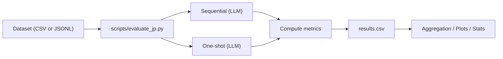
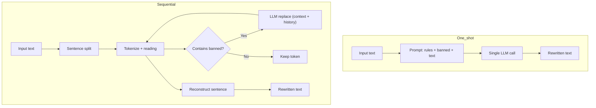
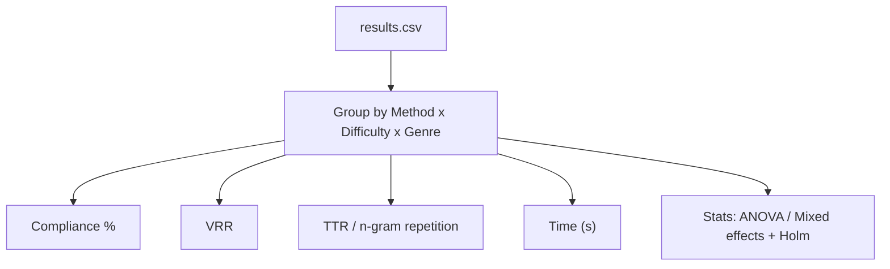

# 日本語リポグラム実験ガイド（改訂版）

本ガイドは、現実装で再現可能な実験プロトコル・評価指標・運用の要点を、図（Mermaid）付きで簡潔にまとめたものです。

## 1. 実験の目的と範囲
- 目的: 逐次LLM（文脈活用）と一発LLM（ベースライン）を比較し、制約遵守・VRR・多様性・実行時間の差を定量評価
- 範囲: 日本語のみ（英語は参考実装）。JPハイブリッド（BERT+WordNet+LLM）は未実装のため比較対象外

## 2. 比較条件（日本語）
- sequential（逐次）: `RipogramRewriter.rewrite_text_with_context`（文脈利用・トークン逐次）
- oneshot（一発）: `RipogramRewriter.rewrite_text_one_shot`（全文を一回で言い換え）



## 3. データセット仕様
- 形式: CSV または JSONL
  - 必須: `text` または `sentence`
  - 任意: `banned_chars`（例: `い,さ`）、`genre`, `difficulty` など
- 行禁止（例: あ行）は事前展開して `banned_chars` に記述（`あ,い,う,え,お`）

CSV 例
```csv
text,banned_chars,genre,difficulty
"猿も木から落ちる。石の上にも三年。","い,さ",proverb,low
"国境の長いトンネルを抜けると雪国であった。","あ,い,う,え,お",literature,high
```

JSONL 例
```jsonl
{"text": "猿も木から落ちる。", "banned_chars": "い,さ", "genre": "proverb", "difficulty": "low"}
{"text": "今日は良い天気だ。", "banned_chars": "あ,い,う,え,お"}
```

## 4. 手順（再現用）

- 環境準備
  - `pip install -r requirements.txt`
  - `.env` に `OPENAI_API_KEY` を設定（`ripogram/config.py` 参照）
  - スモーク: `python examples/demo_metrics.py`

- 単発検証（CLI）
  - 逐次: `python -m ripogram.cli "猿も木から落ちる。" -b "い,さ" -v`
  - 一発: `python -m ripogram.cli "猿も木から落ちる。" -b "い,さ" -M oneshot -v`

- 一括評価（バッチ）
```bash
python scripts/evaluate_jp.py \
  --input data/dev.csv \
  --output results.csv \
  --model gpt-4.1-nano \
  --methods sequential oneshot \
  --verbose
# 小さく回す: --limit 10
# データに banned_chars 列が無い場合: --banned "あ,い,う,え,お"
```

- 任意（反復評価の推奨）
  - 同一条件・同一入力で評価を3回程度反復し、主要指標（遵守率/VRR/TTR/時間）の平均と95%CIを算出
  - 逐次/一発とも温度は固定（例: 0.5）、プロンプトは共通ルールで一定に保つ

## 5. 手法の内部フロー（概略）



## 6. 評価指標（非加重、ローカル実装）
- 制約遵守（読み基準）: `check_constraint(text, banned, mode="reading")`
- VRR（Vocabulary Replacement Rate）: `compute_vrr(original, rewritten)`
- 多様性: `compute_ttr(text)`, `ngram_repetition_rate(text, n=2/3)`
- 実行時間: `measure_time(callable, ...)`
- 実装: `ripogram/metrics.py`（詳細: `docs/METRICS.md`）



## 7. 出力（results.csv 主要列）
- `id, method, text, banned_chars, output, constraint_violated, constraint_found, constraint_count, vrr, ttr, bigram_rep, trigram_rep, time_sec`
- 任意メタ情報（`genre`, `difficulty` など）はパススルー

## 8. 解析の指針
- 集計: 条件×難易度×ジャンルで平均・分散（遵守率[%], VRR, 時間[秒]）
- 統計: 反復測定ANOVA / 混合効果モデル、事後比較はHolm
- 主観評価（任意）:
  - A/B提示（順序カウンタバランス）、7段階Likert＋二者選択
  - Bradley–Terry/Luce で勝率推定＋有意差検定

## 9. 再現性と運用
- 乱数性: 既定温度0.5（必要に応じて固定/低下）
- 記録: 入力、`banned_chars`、モデル名、実行日時、コミットIDを結果と保存
- ログ: 例外・APIエラーは標準出力/標準エラーに出力

## 10. リスクと対策
- 読みの誤検出: UniDic読み＋`katakana_to_hiragana`で正規化、必要に応じて例外表
- 助詞群の厳格制約: 意味保持低下→温度を下げる/主観評価を補助に
- 長さ大幅変動: VRRはLCS近似で頑健化。極端事例は別途検討

## 11. 付録（よく使うコマンド）
- 指標デモ: `python examples/demo_metrics.py`
- 一括評価: `python scripts/evaluate_jp.py --input data/dev.csv --output results.csv --model gpt-4.1-nano`
- CLI（逐次）: `python -m ripogram.cli "…" -b "い,さ" -v`
- CLI（一発）: `python -m ripogram.cli "…" -b "い,さ" -M oneshot -v`

## 12. 実験計画（改訂）

以下は公平性・再現性・解釈可能性を高めるための改訂方針です（コード拡張が必要な項目は「任意（実装）」と明記）。

### 12.1 デザインと統制
- 条件: `sequential` vs `oneshot`（同一モデル・同一設定で比較）
- 乱数/温度: `temperature=0.5`（固定）。その他サンプリング設定も固定（例: `top_p` 既定）
- 反復: 各入力×各条件で3回実行し、平均・95%CIを算出（小規模でも効果の粗い傾向が見える）
- 層別: 制約タイプ（単音/行/多音）、文長、ジャンル、難易度で層別し、各セルで件数を確保

### 12.2 測定・記録
- 主要指標（実装済）: 制約遵守（reading）、VRR、TTR、n-gram反復、時間
- 併記（推奨）: surface基準の制約チェックも同時出力（sanity用）
- 補助指標（任意）: 正規化編集距離 1 - LevDist(original, rewritten)/max(len, len)
- 公平性（任意・実装）: `api_calls`, `prompt_tokens`, `completion_tokens`, `total_tokens`, `retries` を記録
  - 未計測の場合はN/A管理またはログから再構成

### 12.3 解析
- 集計: 方法×難易度×ジャンル×制約タイプで平均・分散（遵守率[%], VRR, 時間[秒] 等）
- 統計: 反復測定ANOVA / 混合効果モデル（文IDをランダム効果）、事後比較はHolm
- 効果量: Cohen’s d と95%CIを併記（群間差の大きさを解釈）

### 12.4 補助手順（任意）
- グローバル最終検証: 逐次結果に禁止音が残る場合のみ、全文を対象にOne-shotクリーンアップを1回だけ適用
- エラー分析ログ: 違反例/読みに起因する失敗例/不自然表現を10–20件抽出して付録化

### 12.5 データ設計
- 制約セットは難易度別に準備（例: 単音→行→多音）。文長・ジャンルで均衡化
- 各条件で十分な件数を確保（最小でも各セルn≥30を目安）

### 12.6 主観評価（任意）
- A/B提示（順序カウンタバランス、ブラインド）
- 指標: 可読性/意味保持/自然さ（7段階Likert）＋二者選択
- 解析: Bradley–Terry/Luce で勝率推定、有意性はHolmで多重補正
