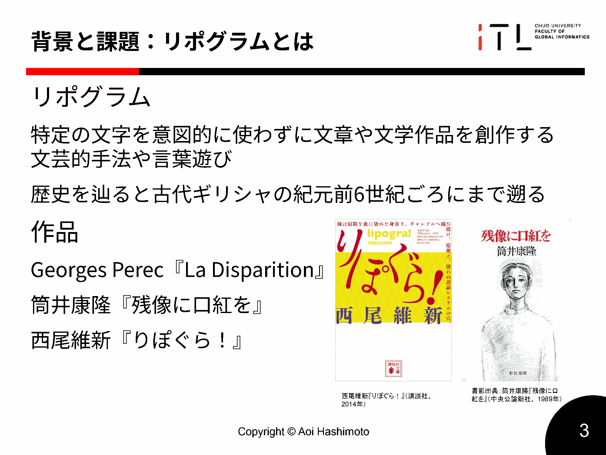
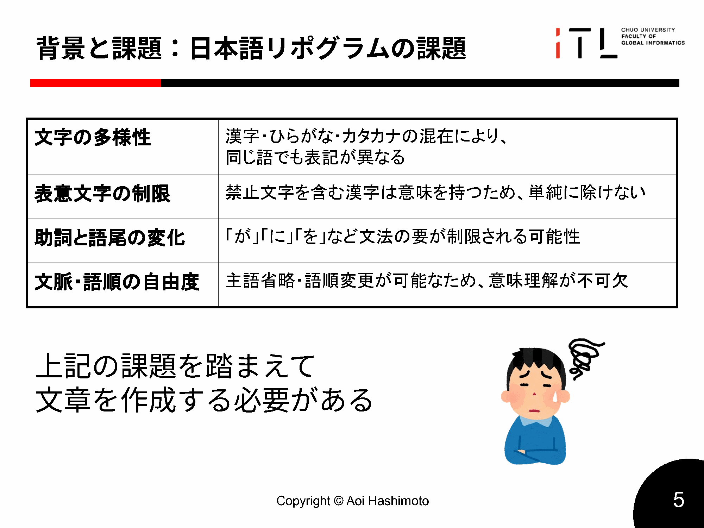

# 第1章 はじめに（Introduction）

本章では、日本語におけるリポグラム自動生成という課題の背景と問題設定を整理し、本研究が提案する「日本語リポグラム生成の枠組み」の目的と位置づけを明確にする。とくに、文字・音レベルの負制約の下で、制約遵守（禁止文字の完全排除）と自然さ・意味保持を両立することが難しい点を述べ、その難しさを扱うための設計単位として枠組み（フレームワーク）を提示する。

## 1.1 研究背景

本節では、リポグラムの概要とその背景を整理し、制約付き文章生成の文脈における位置づけを述べる。とくに、日本語では表記と読みが必ずしも一致しないため、禁止条件をどの水準（表記／読み）で課すかがタスク定義に直結する。この点を踏まえ、本研究が読みベース制約を扱う意義を明確にする。

### 1.1.1 リポグラムの定義
リポグラム（lipogram）とは、特定の文字を意図的に用いないという制約の下で書かれた文章・作品を指す。単なる言語遊戯としての側面に加え、「制約を満たしながら意味の通る文章を作る」という点で、制約付き文章生成（constrained text generation）の具体例として捉えることができる。近年は、敬語変換・スタイル変換・NGワード回避など、条件を満たす出力を生成するタスクが増えており、リポグラムはその中でも「禁止条件がきわめて細かい（文字／音）」という特徴を持つ。

以下に，中間発表で用いたリポグラムの概説スライドを示す。卒論本文では，リポグラムを「文字・音レベルの負制約を課した言い換え問題」として捉える立場をとるが，まずは直感的な説明として提示する。

（図1.1：中間発表スライドより，リポグラムの概要）

### 1.1.2 歴史的事例（La Disparition 等）
リポグラムには著名な歴史的事例が存在する。たとえば Perec（1969）の『La Disparition』は、特定文字を用いないという制約の下で長編小説を成立させた代表例として知られている。このような事例は文化的関心の対象である一方、工学的には「ごく単純な条件（ある文字を出さない）」であっても、人間にとっては創作上の負担が大きく、機械にとっては制御が難しいことを示す例でもある。すなわち、リポグラムは出力制御の難しさを可視化するテストベッドとして機能する。

### 1.1.3 制約付き文章生成との関連
本研究はリポグラム生成を，NGワード回避やスタイル変換を含む制約付き文章生成の一種として位置づける。制約付き生成に関する研究動向や，本研究との関係は第2章で整理する。

### 1.1.4 日本語におけるリポグラムの難しさ
日本語でリポグラムを扱う場合、アルファベット言語とは異なる難しさが現れる。第一に、日本語は漢字・ひらがな・カタカナが混在し、同じ読みを複数の表記で書ける。たとえば、表記上は禁止文字を含まなくても、読みとしては禁止音を含む場合がありうる。そのため、禁止条件を「表記（文字列）」に課すのか「読み（仮名列）」に課すのかによって、タスクの難度や生成可能な表現の範囲が大きく変化する。

第二に、助詞や活用語尾など、高頻度に現れる要素に禁止文字が含まれると、文全体の構造を変えなければ制約を満たせないことがある。単語の置換だけでは回避できず、文の言い回しや構文を再設計する必要が生じる。第三に、日本語は空白による単語区切りが明示されないため、文字列レベルの機械的処理では、意味を保った言い換えの単位を定めにくい。以上の理由から、日本語リポグラムは人手でも難度が高く、自動生成はさらに難しい課題となる。

（図1.2：中間発表スライドより，日本語リポグラムの課題の整理）

## 1.2 問題設定

本節では、本研究で扱うタスクを「禁止文字を一切含まない文章生成」として整理し、なぜ単純な後処理（削除・置換）では十分でないかを述べる。あわせて、制約遵守、意味保持、自然さという複数要件の同時達成が困難であることを示し、評価と再生成制御が必要となる理由を明確にする。

### 1.2.1 禁止文字を含まない文章生成という課題
本研究で扱う中心課題は、「与えられた日本語文と禁止文字集合に対して、禁止文字を一切含まない日本語文を生成する」ことである。単純なアプローチとしては、禁止文字を含む箇所を削除・置換する方法が考えられる。しかし、禁止文字が助詞や語尾に含まれる場合、それを機械的に削除すると文法性が崩れやすい。また、置換で回避しようとしても、置換候補の読みが禁止文字に引っかかるなど、局所修正だけでは解決できないケースが多い。

したがって、この課題は「禁止文字を除去する」だけではなく、必要に応じて文全体を再構成しながら制約を満たす生成を行う問題として捉える必要がある。

### 1.2.2 文法性・意味保持・自然さの両立の困難性
制約付き生成では、一般に「制約遵守」と「品質（意味保持・自然さ）」の間にトレードオフが生じる。禁止文字を厳格に避けようとするほど、言い換えの自由度が制限され、不自然な表現や意味の逸脱が起こりやすい。一方、意味や自然さを優先すると、禁止文字が混入するリスクが高まる。とくにリポグラムでは、制約違反が1文字でも許されないため、このトレードオフは顕著になる。

さらに、日本語リポグラムでは「表記上の制約」と「読み上の制約」がずれる可能性があるため、品質と制約の両方を評価するための枠組み（指標の定義、測定手順）が必要になる。本研究では、制約遵守率を主指標としつつ、意味保持や自然さを測る指標を併用して多面的に評価する。

### 1.2.3 日本語特有の制約問題
日本語では、活用語尾や助詞が高頻度で現れるため、禁止文字がそこに含まれると回避が難しい。また、読みベースの制約を採用する場合、漢字語でも読みが禁止音に引っかかることがあり、表記の工夫だけで回避できない。さらに、形態素解析に依存して読みを得る以上、未知語や解析誤りが存在しうる。これらの要因は、「読みを取れば制御できる」という直観を成立させる一方で、制御の前提（読みの取得と正規化、失敗時の扱い）を明示的に定義する必要があることも示している。

## 1.3 研究目的

本節では、前節で述べた課題に対して、本研究が何を提案し、何を明らかにすることを目標とするかを述べる。とくに、日本語リポグラム生成を実装・評価可能な単位に分解した枠組みを提示し、その有効性を検証するという立場を明確にする。

本研究の目的は、日本語リポグラム生成を、実装・評価可能な形で整理した「枠組み（フレームワーク）」として提案し、その枠組みが制約遵守と品質の両立にどのように寄与するかを明らかにすることである。具体的には、入力仕様（入力文と禁止集合）、制約検査（表記／読み）、生成（LLMによる候補生成）、再生成制御（失敗時の再試行・局所修正）を明確に分離し、それらを接続するパイプラインとして定式化する。

この枠組みの中で、本研究は二つの生成方式を取り扱う。第一は、入力全体を一度に書き換える一発生成方式（oneshot）であり、プロンプトのみで制約を伝える素朴なベースラインとして位置づける。第二は、禁止文字を含む箇所を検出し、その箇所に対して逐次的に介入して書き換える逐次生成方式（sequential）である。方式比較は、本研究の主張を「方式の優劣」そのものに置くのではなく、枠組みの要素（たとえば読みベース制約チェックや局所介入、反復的な再生成制御）が実際に効果を持つことを検証するための手段として行う。

加えて、本研究は生成品質を「意味保持」と「自然さ（文法性・流暢性）」の観点で評価する。制約遵守だけを満たす出力は、実用上・創作支援上は価値が限定的であるため、どの程度まで元文の意味を維持できているか、どの程度自然な日本語として読めるかを併せて検討する。評価方法の詳細（指標の定義と測定手順）は第3章および第6章で述べる。

## 1.4 研究の意義

本節では、本研究が扱う日本語リポグラム生成を、学術的・応用的観点からどのように位置づけるかを述べる。リポグラムそのものの面白さに留めず、出力制御や言い換え支援の基盤技術としての意義を整理する。

### 1.4.1 文学的創作支援
リポグラムは、制約下での創作を促す技法として知られる。本研究で提案する枠組みが実用化されれば、創作者が「禁止文字（禁止音）」を指定し、複数の候補表現を得ながら推敲する、といった創作プロセスを支援できる可能性がある。とくに、日本語では制約を満たす表現探索が難しいため、自動生成による候補提示は負担軽減につながりうる。
### 1.4.2 言語教育支援
制約付き作文は、語彙選択や文法構造への意識を高める練習として利用できる。たとえば、特定の仮名を使わずに同じ意味を表す言い換えを考える過程は、同義表現や言い回しの学習に資する。本研究の枠組みは、禁止条件を明確に与え、生成候補を比較できるため、教材作成や学習支援への応用可能性がある。
### 1.4.3 コミュニケーション支援
読み（音）に対する制約は、発音しづらい音を避けたい状況や、特定音を含まない代替表現が必要な場面と親和性がある。たとえば、発話支援・入力支援の文脈では、「言いにくい音を避けた言い換え」を候補として提示することが有用になりうる。本研究は直接の支援システム構築を目的とはしないが、読みベース制約を中核に据えることで、そのような応用への足がかりとなる設計知見を提供できる。

## 1.5 本研究の貢献（Contributions）

本研究は、タスク定義、実装枠組み、評価プロトコルを一体として整備し、日本語リポグラム生成を体系的に扱う基盤を提供することを目指す。以下に、本研究の主な貢献をまとめる。

1. 日本語リポグラム生成を「入力仕様 → 制約検査（表記／読み） → 生成 → 再生成制御」に分解した枠組みとして定式化し、同一枠組み内で oneshot / sequential を切り替え可能な設計として示す。
2. 読みベース制約チェック（形態素解析で得た読みの正規化を含む）を中核要素として組み込み、漢字・かなの表記差をまたいだ禁止音の検出・制御を可能にする。
3. 評価用データセットと実験パイプライン（自動指標・ログ収集）を整備し、ベースライン／アブレーションを含む比較実験により枠組みの妥当性とトレードオフを示す。
4. 生成結果の比較や失敗例収集を支援するWebアプリケーションを実装し、分析および主観評価の基盤として利用可能にする。

## 1.6 論文構成

本論文の構成を以下に示す。

第2章では、制約付き文章生成、リポグラム生成、および日本語に固有の制約生成に関する関連研究を整理し、本研究の位置づけを明確にする。第3章では、入力・出力・制約（表記／読み）を含むタスク定義と評価指標を定式化する。第4章では、提案する枠組み（パイプラインと制御）と、oneshot/sequential の生成方式を述べる。第5章では、枠組みの実装（制約チェッカー、生成器、評価パイプライン、Webアプリ）を説明する。第6章では、実験条件、データセット、評価手順、統計的検定を含む実験設定を示す。第7章では、実験結果を指標ごとに報告し、第8章で結果の解釈と限界、設計指針を議論する。最後に第9章で、本研究を総括し、今後の課題と発展可能性を述べる。
