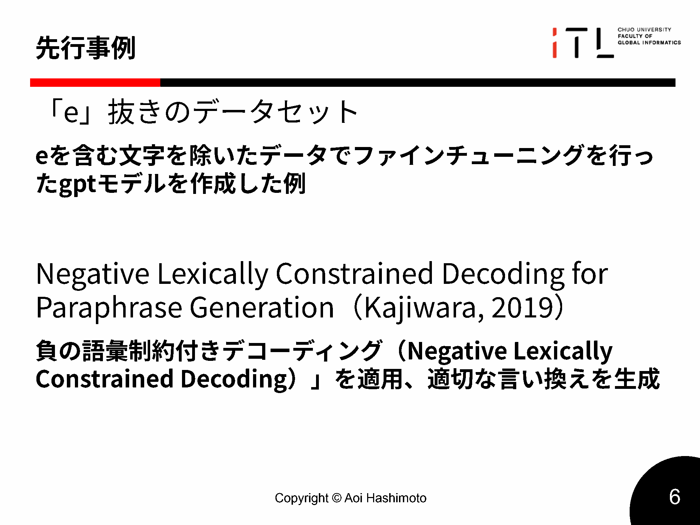

# 第2章 関連研究（Related Work）

本章では、本研究が位置づけられる制約付き文章生成（constrained text generation）の研究動向を整理した上で、リポグラムに関する先行事例と、日本語における制約生成の難しさを概観する。とくに、本研究が扱う「禁止条件を文字・読み（音）レベルで厳格に課し、違反をゼロにする」設定は、NGワード回避やスタイル変換と近い構造を持ちながらも、制約の粒度と厳格さの点で異なる。これらの差分を踏まえ、本研究が提案する枠組み（入力仕様、制約検査、生成、反復制御）の必要性と位置づけを明確にする。

## 2.1 制約付き文章生成

本節では、制約付き文章生成に関する代表的な課題として、NGワード回避やスタイル変換を取り上げ、本研究が扱う「禁止条件の完全遵守（ゼロ違反）」という設定との共通点と相違点を整理する。あわせて、LLM による生成を前提とした場合に、プロンプトのみの制御では十分でないことを述べ、本研究が採用する「検査と再生成を組み合わせる」方針へ接続する。

制約付き文章生成の文脈では、「望ましくない語や表現を出力に含めない」「所望のスタイルに合わせる」といった制約が扱われる。とくに実運用の対話システムやWebサービスでは、有害表現や不適切表現を含まない出力が求められるため、出力制御は重要である。しかし、生成モデルに対してプロンプトで禁止条件を与えただけでは、禁止語の混入を完全に防げないことが多い。出力後にフィルタリングや単純置換を行う方法もあるが、文法性の破綻や意味の欠落が生じやすい。

リポグラムの特徴は、制約の粒度が文字・音レベルであり、違反が「1文字でも混入すれば失敗」として扱われる点にある。NGワード回避のように「多少の揺れを許容できる」場面と異なり、リポグラムでは完全排除（ゼロ違反）が本質的要件となる。この厳格さが、生成過程の制御をより難しくする。関連する試みとして、負の語彙制約（negative lexical constraints）を用いたデコーディングにより、必要箇所を確実に書き換える枠組みも提案されている（Kajiwara、2019）。

図2.1に，中間発表時点で整理した先行事例（英語圏での lipogram データセット／負の語彙制約付きデコーディング）を示す。卒論本文では，これらを足がかりとして，日本語という条件下でのタスク定義と枠組み設計を具体化する。

（図2.1：中間発表スライドより，先行事例の整理）

### 2.1.1 NGワード除去研究
制約付き文章生成の代表例として、NGワード除去や有害表現回避が挙げられる。これらは、出力から特定語を排除するという点でリポグラムと同型の「負制約」を持つ。一方で、多くの実運用では禁止語は単語・フレーズ単位で管理されることが多く、単純な置換やマスク、あるいは生成後のフィルタリングでも一定の効果が得られる場合がある。
しかし、言語モデルの生成においては、単純に「bad words」を禁止するような手法だけでは望ましくない出力を十分に抑えきれないことも報告されている（Gehman ら、2020）。

しかし、禁止語の検出・削除を出力後処理として行うだけでは、文法性の破綻や意味欠落が生じやすい。禁止要素が文の骨格（主語、述語、助詞、否定など）に関わる場合はなおさらであり、局所的な削除ではなく文全体の再構成が必要となる。このため、近年のアプローチでは「検査と再生成を組み合わせる」枠組みが重要になる。具体的には、次のような流れで制御する。

- 制約違反の検出
- 違反箇所の再生成または編集
- 再検査と反復

本研究が扱う日本語リポグラムは、禁止条件が文字・音レベルにまで細分化されるため、この枠組みの必要性がより強く現れる。
生成過程での制約制御としては、負の語彙制約（negative lexical constraints）をデコーディングに組み込む枠組みも提案されている（Kajiwara、2019）。

### 2.1.2 表現変換（敬語・ポジティブ表現化）
スタイル変換（敬語変換、ポジティブ表現化、感情・文体制御など）は、入力文を意味的に保ちながら別の条件を満たす文へ変換するタスクとして研究されてきた。スタイル変換では、意味保持とスタイル達成のトレードオフをどのように制御するかが中心課題となり、評価においても自動指標と人手評価の併用、あるいは複数指標の組合せが議論されている。

リポグラム生成も、「意味を保ちつつ、所望の条件を満たす」という点でスタイル変換と共通する構造を持つ。ただし、スタイル変換では「文体が一定程度変化していればよい」などの連続的な目標として扱えるのに対し、リポグラムでは禁止文字の混入が1文字でもあれば失敗となる、離散的かつ厳格な条件となる点が異なる。したがって、本研究ではスタイル変換の評価設計の知見を参照しつつも、制約遵守を主指標として明確に位置づけ、意味保持・自然さとの関係を多面的に捉える必要がある。
非並列データからのスタイル変換としては、潜在表現のアラインメントに基づく手法（Shen ら、2017）や、Delete–Retrieve–Generate 型の枠組み（Li ら、2018）が代表例として挙げられる。
意味保持の自動評価としては、文埋め込みに基づく類似度のような指標が広く用いられており、代表例として BERT（Devlin ら、2019）が挙げられる。

### 2.1.3 LLM を用いた制約生成
前節までで述べた通り、プロンプトのみで禁止条件を完全に守らせることは難しい。この課題に対し、近年は制約付きデコーディングや negative constraints（負の語彙制約）をデコーディング過程に組み込む研究が報告されている。ただし、商用APIとして提供されるLLMでは、内部のデコーディング制御を利用者側で細かく指定できない場合が多い。そのため、本研究ではAPIベースのLLMを前提とし、次を組み合わせることで、実用的に制約遵守を高めるアプローチをとる。

- 生成後の制約検査
- 再生成・局所修正の反復

## 2.2 リポグラム生成研究

本節では、リポグラムに関する先行事例と公開実装を概観し、とくにアルファベット言語を前提とした手法が日本語へ直接適用しにくい理由を整理する。これにより、日本語では表記と読みのずれを踏まえた制約定義と制御が必要であることを明確にする。

### 2.2.1 英語・フランス語研究
リポグラムの先行事例は、英語やフランス語などアルファベット言語に関するものが中心である。たとえば Perec（1969）の『La Disparition』は、特定文字を用いない長編作品として著名であり、制約下での創作が成立することを示してきた。アルファベット言語では、文字と音の対応が日本語に比べて単純であることが多く、「特定文字を含まない」という条件が比較的直接的に扱える。この点は、工学的にも、文字列レベルの検査・探索と相性がよい。

一方、日本語では表記体系が複雑であり、同じ音を複数の表記で書ける。したがって、「表記上の禁止」と「読み上の禁止」は必ずしも一致せず、どちらを制約として採用するかがタスク定義に直結する。本研究は、この差分が顕在化する日本語を対象として、読みベース制約を含む定義と評価を行う点に特徴がある。

### 2.2.2 公開実装例（GitHub 等）
公開実装としては、特定文字を含む単語を辞書的に置換する方式、あるいは使用可能な語彙を列挙して探索する方式などが見られる。アルファベット言語では、語彙が空白で区切られるため、単語単位の置換や探索が比較的自然に定義でき、文字列検査も単純である。

しかし、日本語では空白による単語区切りが明示されず、表層の文字列操作だけでは「意味を保った置換」を単語単位で行うことが難しい。また、漢字表記は表層文字列に禁止仮名が現れない一方で、読みとしては禁止音を含みうるため、表層文字列だけを見た検査では不十分になりうる。以上から、英語前提の単語置換ベース実装をそのまま日本語へ適用することは困難であり、日本語に合わせた制約検査と再生成制御が必要となる。
関連する公開実装の例として、フランス語リポグラム生成を扱う GitHub リポジトリも報告されている（Loujain、2025）。

### 2.2.3 既存手法の限界
既存のリポグラム生成（とくに簡易実装）では、制約違反を避けること自体は達成できても、意味保持や文法性（自然さ）を十分に担保できない場合がある。また、制約遵守が主目的であるがゆえに、意味保持や自然性をどのように測り、どの程度を許容するかといった評価基準が明確でないことも多い。

本研究は、制約遵守（ゼロ違反）を主指標として明確化しつつ、意味保持・自然性・計算コストを併せて測定することで、「制約を守れるが不自然」や「自然だが制約違反」といったトレードオフを定量的に議論できる枠組みを整備する点に意義がある。

## 2.3 日本語の制約生成

本節では、日本語の言語的特性が制約付き生成に与える影響を整理し、本研究が読みベース制約を重視する理由を述べる。あわせて、NGワード回避との違い（制約単位と要求精度）を明確化し、日本語リポグラム生成が独自の難しさを持つことを示す。

### 2.3.1 日本語リポグラム研究の未整備
日本語リポグラムを主題とした体系的研究は多くない。個人レベルの創作や小規模な試行は散発的に存在するものの、タスク定義、評価指標、実験プロトコルを揃えた比較研究は限定的である。この状況は、本研究にとって「関連研究が薄い」ことを意味するだけでなく、逆に、タスク定義と評価枠組みを明示すること自体が貢献になりうることを示している。

### 2.3.2 日本語特性（形態素・表記揺れ・助詞）
日本語は、次の性質を持つ。

- 形態素境界が空白として現れにくい
- 漢字・ひらがな・カタカナが混在し表記揺れが大きい
- 助詞や活用語尾など高頻度要素が文の骨格に強く関与する

これらは、禁止条件が一部の高頻度仮名を含む場合に、局所的な置換では回避できず、文の構造を変える必要が生じることを意味する。また、読みベース制約を課す場合は、形態素解析により読みを得て検査することが実装上の前提となるため、解析失敗や未知語の扱いが制御の一部となる。

### 2.3.3 NGワード研究との差分
NGワード回避と日本語リポグラムは、いずれも「望ましくない要素を含まない出力」を求める点で共通するが、要求精度と制約単位が異なる。リポグラムでは、文字・音レベルの禁止であり、違反が1文字でも許されないため、誤検知・漏れの許容度が低い。また、読みベース制約では、表記上の文字列検査だけでなく、読みへの写像（形態素解析と正規化）を含む判定が必要となる。したがって、本研究では、制約検査と再生成制御を明確に分離した枠組みとして設計し、評価においても「読みベースで違反ゼロ」を主指標として扱う。

## 2.4 本研究の位置づけ
以上の整理を踏まえると、本研究は、日本語リポグラム生成という未整備領域に対して、読みベース制約を含む明確なタスク定義と、実装・評価可能な枠組みを提示する応用研究として位置づけられる。具体的には、入力仕様（禁止集合の正規化・展開）、制約検査（表記／読み）、生成（LLMによる候補生成）、再生成制御（反復と停止条件）を分離し、パイプラインとして統合する。また、同一枠組み内で oneshot / sequential を切り替え可能にすることで、「逐次的介入」や「反復制御」といった要素の寄与を、ベースラインおよびアブレーションを通じて検証できる形にする。さらに、生成結果の比較や失敗例収集を支援するWebアプリケーションを併設することで、定量評価に加え定性分析や主観評価へ発展可能な基盤を提供する。

## 参考文献（本章）

- G. Perec, *La Disparition*, Éditions Denoël, Paris, 1969.
- S. Gehman, S. Gururangan, M. Sap, Y. Choi, and N. A. Smith, “RealToxicityPrompts: Evaluating Neural Toxic Degeneration in Language Models,” *Findings of EMNLP 2020*, pp. 3356–3369, 2020.
- T. Kajiwara, “Negative Lexically Constrained Decoding for Paraphrase Generation,” *Proc. EMNLP-IJCNLP 2019*, pp.6042-6048, 2019.
- J. Devlin, M.-W. Chang, K. Lee, and K. Toutanova, “BERT: Pre-training of Deep Bidirectional Transformers for Language Understanding,” *Proc. NAACL-HLT 2019*, pp.4171-4186, 2019.
- T. Shen, T. Lei, R. Barzilay, and T. Jaakkola, “Style Transfer from Non-Parallel Text by Cross-Alignment,” *Advances in Neural Information Processing Systems 30 (NeurIPS 2017)*, 2017.
- J. Li, R. Jia, H. He, and P. Liang, “Delete, Retrieve, Generate: A Simple Approach to Sentiment and Style Transfer,” *Proc. NAACL-HLT 2018*, pp.1865-1874, 2018.
- L. Loujain, “lipogram_e: French lipogram text generation with GPT models,” GitHub repository, 2025.
