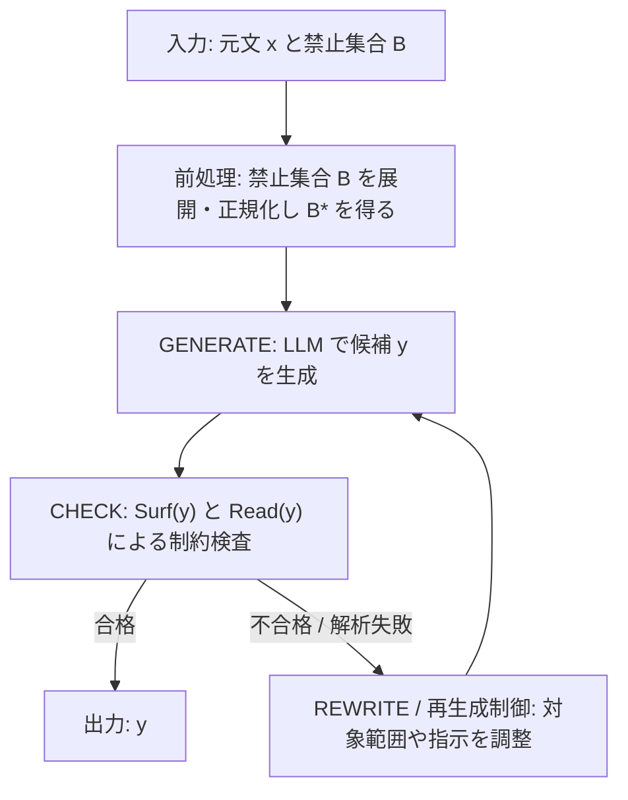
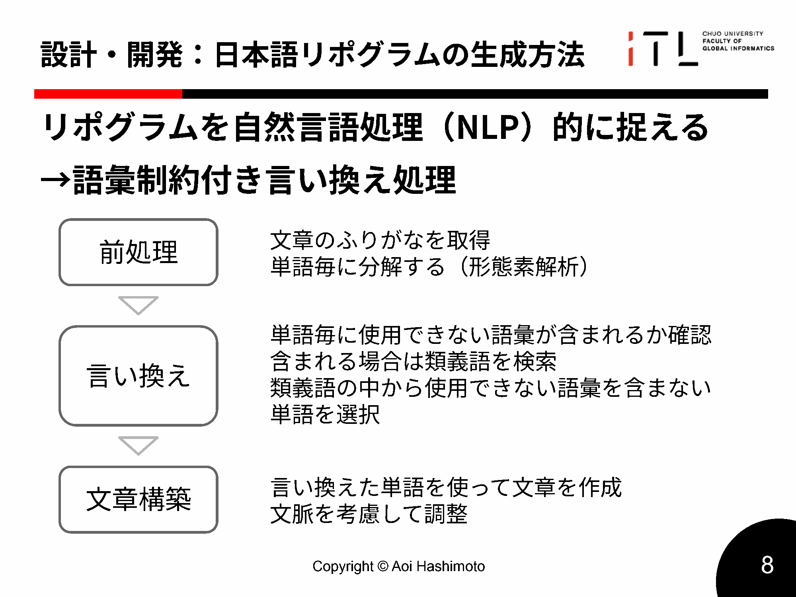

# 第4章 手法（Methods）

本章では，第3章で定義した日本語リポグラム生成タスクに対して，本研究が用いる生成枠組み（フレームワーク）を述べる。枠組みは，入力文と禁止集合を受け取り，制約検査（表記／読み）と生成（LLM）と再生成制御を組み合わせて，制約違反のない出力を得るパイプラインとして構成される。本研究では，この枠組みの内部実装として，一発生成方式（oneshot）と逐次生成方式（sequential）を同一条件で比較できるように設計する。

## 4.1 全体アーキテクチャ

本節では，本研究が採用する日本語リポグラム生成枠組みの全体像を示す。とくに，制約チェックと生成を往復させるパイプライン構造と，oneshot／sequential の二方式がその中でどのように位置づくかを整理する。

### 4.1.1 システム概要
本研究で用いる生成枠組みは，次のモジュールから構成される。

第一に入力処理モジュールは，入力文 \(x\) と禁止集合 \(B\) を受け取り，第3章で定義した正規化・展開により禁止集合 \(B^\*\) を得る。第二に制約検査モジュールは，出力候補 \(y\) が制約を満たすかを判定する。判定は表記ベース制約（\(\mathrm{Surf}(y)\) に \(B^\*\) が含まれない）および読みベース制約（\(\mathrm{Read}(y)\) に \(B^\*\) が含まれない）に基づく。第三に生成モジュールは，LLM を用いて候補文を生成する。第四に再生成制御モジュールは，制約違反や解析失敗が生じた場合に，生成の対象範囲（局所／全文）や指示（プロンプト）を調整しながら再試行を行い，停止条件に到達するまで反復する。

以降では，この枠組みの処理の流れを CHECK→GENERATE→REWRITE の三段階として説明し，その上で oneshot と sequential の違いを述べる。

### 4.1.2 パイプライン構造（CHECK → GENERATE → REWRITE）
本研究の枠組みは，次の三段階で記述できる。

CHECK 段階では，候補文が禁止集合 \(B^\*\) に違反していないかを検査する。検査は，表記ベース（\(\mathrm{Surf}(y)\)）と読みベース（\(\mathrm{Read}(y)\)）の双方で行う。sequential 方式では，この段階で違反箇所（違反トークン）を同定し，後続の局所書き換え対象を決定する。

GENERATE 段階では，LLM により新たな候補を生成する。oneshot 方式では，入力文全体を対象に 1 回の生成で候補文 \(y\) を得る。一方，sequential 方式では，違反箇所を含むトークン（または局所区間）を対象として，文脈を保ちながら置換候補を生成する。

REWRITE 段階では，生成された候補を適用して文を更新し，再度 CHECK 段階で制約を満たすかを判定する。制約違反が残る場合は，再生成制御により，プロンプトの変更，対象範囲の拡大（局所→全文），再試行回数の上限などの規約に従って反復する。

図4.1に，本研究の枠組み（入力→制約チェック→生成→再書き換え→再検査→出力）の流れを示す。図は CW 予稿・中間報告で用いた構成図を，本論文向けに「生成と検査の反復」という要点が伝わる形に再構成したものである。

（図4.1：CHECK→GENERATE→REWRITE に基づく日本語リポグラム生成パイプライン）

図4.2に，中間発表で用いた「生成方法の概観」を示す。図4.1が本論文の処理フローを抽象化して示すのに対し，図4.2は「読み取得→単語単位の検査→書き換え」という直感的な見取り図として補助的に参照する。

（図4.2：中間発表スライドより，日本語リポグラム生成方法の概観）

### 4.1.3 逐次生成と一発生成の違い
oneshot と sequential の主な違いは，介入粒度と再試行の構造にある。oneshot は全文を一度に言い換えるため，実装が単純で API 呼び出し回数も少ない一方，違反が残った場合は全文を再生成する以外に介入しづらい。sequential は違反箇所を同定して局所的に書き換えるため，必要な箇所に集中して修正でき，制約遵守率の向上が期待できる。一方で，複数回のチェックと再試行が生じやすく，API 呼び出し回数や実行時間は増加する。

表4.1に，両方式の設計上の差分をまとめる。

（表4.1：oneshot と sequential の比較）

|観点|oneshot（全文一括）|sequential（局所介入）|
|---|---|---|
|介入単位|文全体|トークン/局所区間（必要に応じて拡大）|
|違反検出|生成後に全文検査|違反箇所の同定を行い，書き換え対象にする|
|再試行の基本形|全文を再生成|局所書き換え→再検査を反復|
|計算コスト|API 呼び出し回数は少なめ|チェックと再生成が増えやすい|
|期待される性質|簡潔だが「あと一歩」の違反が残りやすい|必要箇所へ集中して修正しやすい|

## 4.2 制約チェックアルゴリズム

本節では，第3章で定義した表記ベース制約／読みベース制約に基づき，候補文 \(y\) が禁止集合 \(B^\*\) を含むかどうかを判定する手順を述べる。本研究では，LLM の出力をそのまま信頼するのではなく，外部の決定的な検査（deterministic check）により「違反ゼロ」を保証し，違反が検出された場合は再生成へ回すという設計を採る。

### 4.2.1 文字レベルチェック
表記ベース制約の検査では，候補文 \(y\) を正規化した表層文字列 \(\mathrm{Surf}(y)\) を作り，\(\mathrm{Surf}(y)\) に禁止集合 \(B^\*\) の各要素が含まれるかを調べる。ここでの正規化は，第3章の定義に従い，少なくともカタカナをひらがなへ変換する操作を含む。検査は単純な部分文字列探索（または同等の正規表現）として実装できる。

表記ベース制約は，漢字表記には直接反応しないため，読みベース制約と併用することで「表記を変えても読みとしては禁止音を含む」ケースを検出できるようにする。

### 4.2.2 読みレベルチェック
読みベース制約の検査では，候補文 \(y\) を形態素解析し，各トークンの読みを取得する。取得した読み（多くの場合カタカナ）をひらがなへ正規化し，連結した仮名列を \(\mathrm{Read}(y)\) とする。次に，\(\mathrm{Read}(y)\) に禁止集合 \(B^\*\) の各要素が含まれるかを検査する。

第3章で述べた通り，読みが取得できないトークンが存在する場合は安全側に倒し，読みベース制約の判定に失敗（違反）とみなす。このとき，oneshot では全文再生成の対象とし，sequential では局所書き換えの対象範囲を拡大する（例：トークン→文）などの再生成制御により対処する。

### 4.2.3 複合制約チェック（文字＋読み）
本研究では，表記ベース制約と読みベース制約を併用し，いずれか一方でも違反している場合は違反とみなす。すなわち，\(\mathrm{Surf}(y)\) と \(\mathrm{Read}(y)\) の双方が禁止集合 \(B^\*\) を含まない場合にのみ，候補文 \(y\) を制約遵守と判定する。これにより，表記と読みのいずれの観点でも禁止集合を回避する出力のみを「成功」として扱える。

## 4.3 生成アルゴリズム

本節では，候補文を生成する際の LLM への指示（プロンプト設計）と，oneshot／sequential の二方式の生成手順を述べる。両方式は「外部の制約チェックに合格するまで再試行する」という点を共有する一方，介入単位（全文か局所か）と再試行の構造が異なる。

### 4.3.1 LLM 生成（共通部）
oneshot と sequential は，いずれも LLM に対して「禁止集合 \(B^\*\) を読みベースで一切含まないこと」を明示し，出力形式を「書き換え後の文のみ」に限定する。禁止集合は，展開・正規化後の \(B^\*\) を提示する（例：行指定を展開したひらがな列）。

また，プロンプトには少なくとも次の要素を含める。さらに，評価を容易にするため，出力は 1 文（または 1 段落）のみとし，説明文や箇条書きなどの付帯情報を混ぜないように指示する。

- 元文 \(x\)（書き換え対象）
- 禁止集合 \(B^\*\)（ひらがな列）
- 禁止条件が「読み（仮名列）」に対して課されること
- 日本語として自然であり，元文の主要な意味を大きく損なわないこと

生成パラメータ（temperature, top\_p など）は方式間で揃え，方式差がプロンプトや推論手順に起因するように統制する。具体的な設定値は第6章で述べる。

### 4.3.2 oneshot（全文一括）
oneshot 方式では，入力文 \(x\) と禁止集合 \(B^\*\) をまとめて LLM に与え，全文を 1 回で書き換えた候補文 \(y\) を得る。得られた \(y\) に対して制約検査を行い，制約を満たす場合は出力として採用する。制約違反が検出された場合は，再生成制御により再試行を行う。再試行では，禁止集合の強調，出力形式の再確認，温度の調整など，生成の安定性に影響する条件を変更しうるが，方式間比較のため，実験では再試行の有無や回数を条件として明示する。
oneshot は，失敗時に「どこが違反か」を局所的に修正しづらいため，再試行は基本的に全文を対象として同一タスクを繰り返す形になる。本研究の方式比較では，条件の公平性のため，実験では生成パラメータを固定し，同一条件で再試行回数のみを制御する。

### 4.3.3 sequential（局所介入）
sequential 方式では，入力文 \(x\) を形態素解析してトークン列を得た上で，各トークンについて表記および読みのどちらかが禁止集合 \(B^\*\) に違反しているかを判定し，違反トークンを同定する。違反トークンが見つかった場合に限り，その箇所に局所的に介入して書き換えを行う。

書き換えでは，対象トークンを含む文（または近傍の文脈）をプロンプトに含め，「この部分を禁止集合に違反しない表現へ言い換える」ように LLM に指示する。生成した置換候補を適用した後，文全体（または対象区間）に対して再度制約検査を行う。違反が残る場合は，所定回数の範囲で再試行し，それでも解消しない場合は対象範囲を拡大する（例：トークン→句→文，あるいは全文の再生成へフォールバック）といった戦略をとる。

この方式の特徴は，「違反箇所が見つかったときだけ」局所的な再生成を行う点にある。これにより，全文を丸ごと再生成するよりも，制約遵守のための介入を必要箇所へ集中できることが期待される。

## 4.4 再生成アルゴリズム
本節では，制約違反や解析失敗が生じた際に，再生成（再試行）をどのように駆動するかを述べる。本研究の枠組みは「生成→検査」を基本単位とし，検査で失敗した場合のみ再試行を行う。これにより，生成モデルが出力した文を必ず外部で検証し，違反を残したまま採用しない運用を実現する。

### 4.4.1 失敗ケースの判定
本研究の枠組みでは，次の場合に「失敗」と判定し，再生成（再試行）を行う。

1. 表記ベース制約または読みベース制約に違反した場合
2. 読みが取得できないトークンが存在し，読みベース制約の判定に失敗した場合
3. 出力形式が規約に違反し，評価に使用できない場合（例：説明文を混ぜる）

### 4.4.2 再生成戦略
再生成戦略は方式により異なる。oneshot では全文再生成を基本とし，制約違反が出た場合は「条件を明示した同一タスクを繰り返し解かせる」形で再試行する。一方，sequential では局所書き換えの反復を基本とし，違反箇所が解消しない場合に限って対象範囲を段階的に拡大する（トークン→句→文→全文）という方針を採る。局所介入での修正が困難な例（助詞や活用語尾が禁則に抵触する例など）では，早期に「文単位の再構成」へ切り替えることが有効であると考えられる。

### 4.4.3 停止条件
いずれの方式でも，停止条件（最大試行回数など）を満たした場合は，制約を満たす出力が得られなかった例として記録し，評価時には失敗として扱う。sequential では，局所反復の無限ループを避けるため，次のように階層的な上限を設ける。

- 局所での最大試行回数
- 文単位での最大試行回数
- 文全体での最大反復回数
