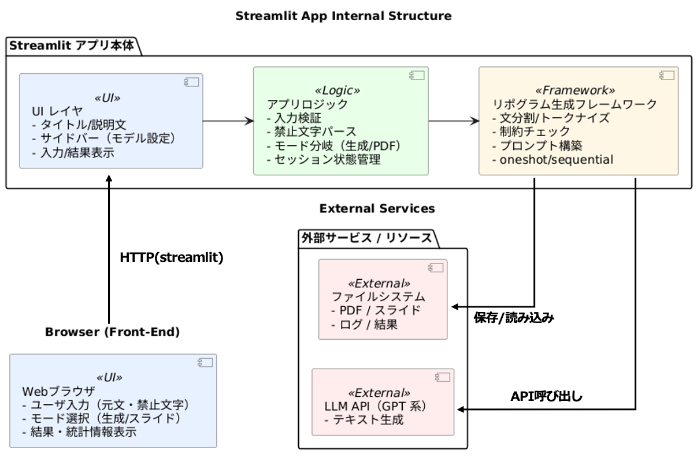

# 第5章 実装（Implementation）

本章では，第4章で述べた日本語リポグラム生成の枠組みを，実際のシステムとしてどのように実装したかを概説する。本研究の成果物は次の三つとして整理できる。

- 日本語リポグラム生成ロジック
- バッチ評価と可視化のパイプライン
- ブラウザから試せる Web アプリ

詳細なアルゴリズムや評価指標の定義は，第3〜4章および第6章で述べる。

## 5.1 実装の設計方針

実装の基本方針は，「生成ロジック」と「利用形態（実験／デモ）」を分離し，同一の生成ロジックをバッチ評価と Web アプリの双方から呼び出せるようにすることである。これにより，実験で得られた失敗例を Web アプリ上で再現して観察するなど，分析と試行を往復しやすくなる。

また，本研究は読みベース制約を主制約として扱うため，形態素解析によりトークンの読みを取得し，ひらがなへ正規化した上で禁止文字の有無を判定する処理を，生成と評価の両方で共通に用いる。

## 5.2 使用技術（ライブラリ）

日本語リポグラム生成の実装では，LLM の呼び出しに OpenAI API クライアントを用い，日本語の読み取得には UniDic を用いた形態素解析（fugashi）を利用する。実験の集計・統計処理には pandas と scipy，可視化には matplotlib / seaborn を用いる。Web アプリは Streamlit により実装した。API キー等の設定は `.env` を通じて管理する。

## 5.3 バッチ評価パイプラインの概要

第6〜7章の実験では，入力データ（元文と禁止集合の組）を CSV として管理し，これに対して生成方式を切り替えながら一括で書き換えを行い，指標を計算して結果を保存する。保存した結果をもとに成功率や補助指標を集計し，グラフを生成して結果報告へ用いる。実験条件（データセット，モデル設定，生成パラメータ，統計的検定）は第6章で詳述する。

## 5.4 Web アプリケーションの概要

Web アプリは，研究者自身の試行とデモを目的とし，ブラウザ上で元文と禁止文字を入力して生成結果を確認できるようにした。画面上では入力と出力を見比べられるように表示し，必要に応じて詳細表示（逐次処理のログ）も確認できる。設計上は，Web アプリを「UI 層」として薄く保ち，生成そのものは共通の生成ロジックを呼び出すことで，バッチ評価と同一の実装に基づいて挙動を観察できるようにしている。

図5.1に，Web アプリを含むシステム構成（入力→生成→評価→表示）の全体像を示す。

（図5.1：Web アプリを含むシステム構成）

図5.1の上段は Streamlit アプリ内部を，UI レイヤ，アプリロジック，生成フレームワークの3層に分けて示している。UI レイヤでは入力（元文・禁止文字）と結果表示を担い，アプリロジックでは入力検証や禁止文字のパース，表示モードの切替，セッション状態管理などを行う。生成フレームワークは，第4章で述べた枠組み（文分割・トークナイズ，制約チェック，プロンプト構築）に基づき，LLM を呼び出してリポグラム文を生成する。

図5.1の下段は外部サービス／リソースとの関係を示している。生成フレームワークは外部の LLM API（GPT 系）に問い合わせてテキストを生成し，アプリは必要に応じてファイルシステム上の資料（PDF/スライド）や結果（ログ）を参照して表示する。なお，生成方式（oneshot/sequential）は生成フレームワーク側で切り替え可能な設計とし，実験（第6〜7章）では方式差を比較する。

なお，現時点の Web アプリは研究用途（試行・例収集）を想定しており，主観評価実験に転用する場合は，出力の永続保存，参加者の匿名化，A/B 提示の順序制御などの追加機能が必要となる。これらは第9章で今後の課題として述べる。
