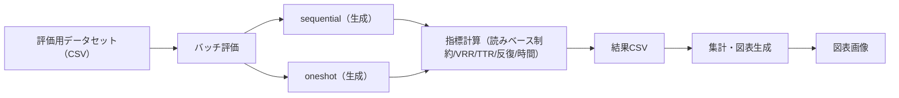

# 第6章 実験設定（Experimental Setup）

本章では，第7章の結果が再現可能になるように，実験に用いたデータセット，モデル設定，評価指標，および集計・検定手順を具体化する。とくに，本研究は「読みベース制約を必須要件とし，違反ゼロを成功とする」点に特徴があるため，読み取得・正規化・判定規約を明記する。あわせて，oneshot／sequential の比較が公平になるように条件を統制し，主指標（制約遵守率）と補助指標（VRR/TTR 等）をどのように測定・集計するかを整理する。

## 6.1 実験条件

本節では，oneshot／sequential の比較が公平になるように，モデルと生成条件を統制する。LLM は OpenAI の Chat Completions API を通じて利用し，比較実験では `gpt-4.1-nano` を基準モデルとして用いる。両方式で同一モデルを使用することで，方式差が「枠組み（推論手順）」に起因するように統制する。

生成パラメータは方式間で揃える。本実験では温度を `temperature=0.5` に固定し，その他サンプリング設定も固定する（例：`top_p` は既定値）。これにより，乱数性の影響を抑えつつ，oneshot／sequential の差を比較する。

なお，意味保持を自動評価する指標（意味類似度など）を導入する場合は，使用モデルや算出方法を明記する必要がある。本論文では，まず制約遵守を主目標として比較を行い，意味類似度指標の導入は今後の課題として位置づける。

## 6.2 データセット

本節では，実験に用いる入力データ（元文と禁止集合の組）の作り方と性質を述べる。評価の解釈は入力データの分布や難易度に影響されるため，出典・抽出条件・制約条件（easy/medium）を明確にする。

### 6.2.1 元文データ
データは Tatoeba 由来の日本語例文コーパスから抽出した。まず，文字数 20〜60 程度で，ひらがなまたは漢字を含む文を条件として 200 文をサンプルし，これをベース文集合とした。その後，各ベース文に対して禁止集合を付与して制約付きパターンを展開し，評価用データセット（465 パターン）を構成した。

表6.1に，ベース文集合と評価用データセットの規模と文長統計を示す。評価用データセットでは，禁止集合に該当する仮名が表記に含まれる場合のみパターンとして採用するため，結果として 195 文が評価対象に含まれる。

（表6.1：データセット概要）

|データ|行数|ユニーク文数|文字数（平均/中央値/最小/最大）|備考|
|---|---:|---:|---:|---|
|ベース文集合|200|200|25.0 / 23 / 20 / 58|Tatoeba から抽出|
|評価用データセット|465|195|25.4 / 23 / 20 / 58|制約付き展開後|

### 6.2.2 禁止文字設定
禁止集合は，単音禁止（easy）と行禁止（medium）の2水準を用意する。easy では 1 文字のみを禁止し，medium では行単位で5文字をまとめて禁止する。表6.2に，禁止集合の種類と，評価用データセットにおける出現件数（パターン数）を示す。

（表6.2：禁止集合の種類と件数）

|制約強度|禁止集合（例）|件数|
|---|---|---:|
|easy|`い`|115|
|easy|`さ`|34|
|easy|`ら`|46|
|medium|`あ,い,う,え,お`|160|
|medium|`か,き,く,け,こ`|110|

本実験では，制約強度（easy／medium）を主要な条件として扱う。文長やジャンルなどの層別は，将来の拡張として設計可能であるが，本データセットではジャンルは `tatoeba` に統一されている。より多様なジャンル（ことわざ，物語文など）を含む設計は今後の課題として第9章で述べる。

### 6.2.3 データの例
表6.4に，評価用データセットに含まれる入力例を示す。各行は「元文 \(x\)」と「禁止集合 \(B\)」の組であり，評価ではこの組に対して oneshot と sequential の両方式で書き換えを行う。

（表6.4：入力例（元文＋禁止集合））

|元文（例）|禁止集合（例）|制約強度|
|---|---|---|
|彼がこういうことを言ったのだと思われる。|`い`|easy|
|母の日にお母さんにカーネーションをあげた。|`さ`|easy|
|彼は一生懸命やっているからうまくいくだろう。|`ら`|easy|
|彼がこういうことを言ったのだと思われる。|`あ,い,う,え,お`|medium|
|彼がこういうことを言ったのだと思われる。|`か,き,く,け,こ`|medium|

## 6.3 評価方法

本節では，同一入力に対して oneshot と sequential を適用し，成功判定（読みベース制約）と補助指標を計算する手順を述べる。評価は「生成→制約検査→指標計算→結果保存」を基本単位とし，これを全入力に対して繰り返す。

### 6.3.1 意味保持評価
意味保持は品質要件であり，制約遵守（主指標）を満たした上で評価すべき対象である。本論文では，意味保持そのものを自動指標で直接測るのではなく，まず書き換えの大きさ（VRR）や語彙の性質（TTR・n-gram 反復率）を補助指標として計測し，第8章で代表例に基づく定性的な議論を行う。意味類似度指標（BERT 類似度など）の導入は今後の課題とする。

### 6.3.2 文法性評価
文法性・自然性は，最終的には人手評価が必要である。主観評価を行う場合は，A/B 比較（oneshot vs sequential）をブラインドで提示し，可読性・自然さ・意味保持を Likert 尺度で評価する設計が考えられる。現時点で主観評価が未実施の場合は，自動指標のみで断定できる範囲を限定し，第8章で代表例を用いて議論する。

### 6.3.3 制約遵守率評価
制約遵守率は読みベース制約を主指標として計測する。具体的には，生成文を形態素解析して得られる各トークンの読み（カタカナ）をひらがなへ正規化し，連結した \(\mathrm{Read}(y)\) に禁止集合が含まれるかで判定する。読みが取得できないトークンが存在する場合は安全側に倒し，制約判定に失敗（違反）として扱う（第3章）。

### 6.3.4 補助指標（VRR/TTR/反復率/時間）
制約遵守以外の性質を捉えるために，補助指標として VRR（語彙置換率），TTR（語彙多様性），n-gram 反復率，実行時間を計測する。これらは評価用の実装で算出し，記号トークンを除外した上で計算する（詳細は付録）。VRR は，トークン数が入力と出力で一致しない場合に備え，最長共通部分列（LCS; Longest Common Subsequence）に基づく近似を用いて「どれだけ置換が起きたか」を頑健に見積もる。

### 6.3.5 ベースライン
比較対象は oneshot と sequential の2方式である。oneshot は「プロンプトで禁止集合を与え，全文を一度に書き換える」素朴なベースラインとして位置づける。sequential は，違反箇所の検出と局所介入を行う枠組みとして位置づけ，両者を同一モデル・同一生成パラメータで比較する。

### 6.3.6 アブレーション（枠組み要素の寄与）
枠組み要素の寄与を切り分けるためには，読みチェックなし（表記のみ），局所修正なし（全文のみ），再生成制御なし（1回生成のみ）などのアブレーションを設計できる。本論文では，まず oneshot／sequential の比較結果を報告し，アブレーションは今後の拡張として実施可能な形で設計方針を整理する。

### 6.3.7 統計的検定
成功率は同一入力に対する方式比較であるため，対応のある検定により差の有意性を確認する。本研究では，成功フラグ（0/1）について対応のある t 検定を行い，方式差の有無を検討する。連続値の指標（VRR/TTR 等）については，「両方式が成功したペア」に限定した上で，対応のある t 検定により方式差を検討する。多重比較を行う場合は Holm 法などの補正を用いる。

表6.3に，本実験で用いる主要な比較条件と評価指標の対応関係をまとめる（中間発表の「実験条件と評価指標」の整理を，本論文向けに再構成した）。

（表6.3：実験条件と評価指標）

|項目|設定|位置づけ|
|---|---|---|
|データ|評価用データセット（465パターン）|評価対象|
|方式|`oneshot` / `sequential`|比較条件（主）|
|主制約|読みベース制約（\(\mathrm{Read}(y)\)）|必須要件|
|主指標|制約遵守率（読み）|主指標|
|補助指標|VRR, TTR, n-gram 反復率, 実行時間|品質・性質の補助|
|モデル|`gpt-4.1-nano`（Chat Completions）|統制条件|
|生成設定|`temperature=0.5`（固定）|統制条件|

## 6.4 再現性情報

本節では，本実験を再実行するために必要な情報を整理する。LLM を用いるため完全な決定性は得られないが，入力データと条件を固定し，結果（生成文と指標）を CSV として保存することで，第7章の集計と図表生成は再現できる。

本研究の実験はバッチ実行により再現できる。評価用データセット（CSV）を入力し，方式とモデル名を指定して生成・評価を行い，結果を CSV として保存する。

図6.1に，バッチ評価の処理フロー（入力→方式別生成→指標計算→結果保存→集計・可視化）を示す。生成はネットワーク（LLM API）に依存するが，指標計算と集計・図表生成はローカルで完結する。

（図6.1：バッチ評価パイプラインの処理フロー）

LLM 生成は確率的であるため，温度を固定しても完全な再現は保証されない。再現性を高めるためには，同一条件で複数回実行して平均・信頼区間を報告する方法があるが，本論文ではまず方式差の大きさを明確にすることを優先し，単回実行の結果を中心に報告する。
