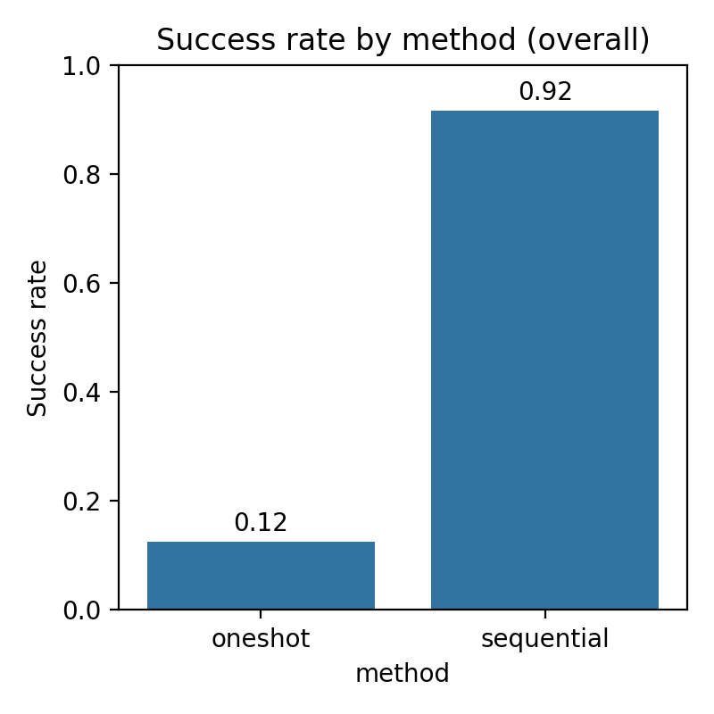
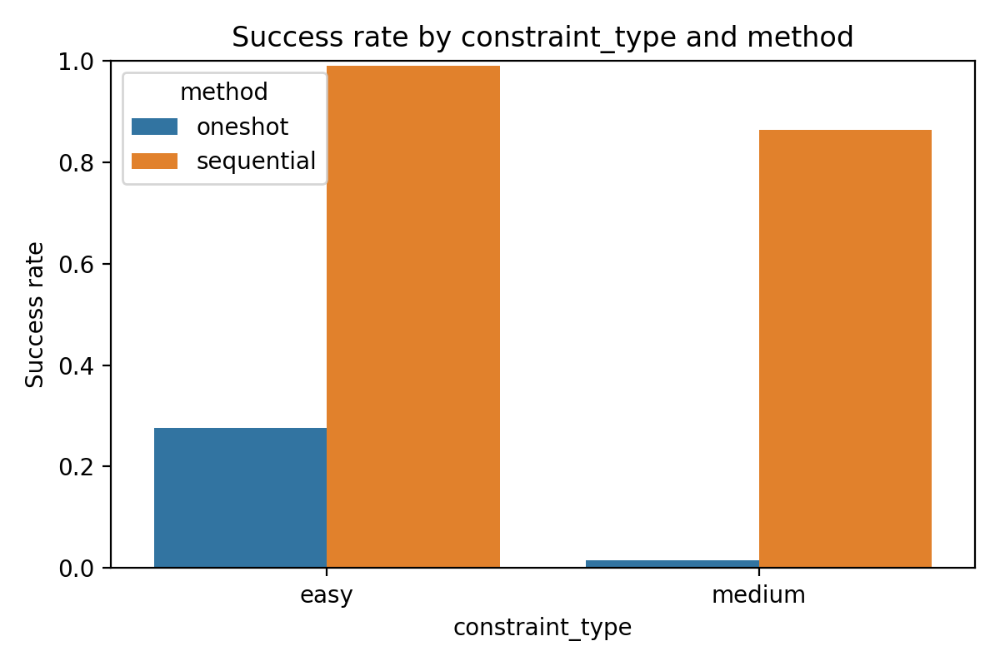
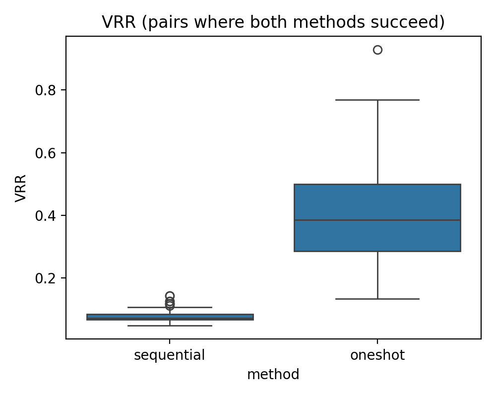
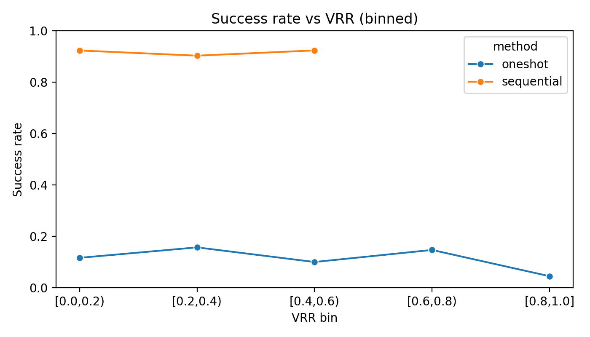
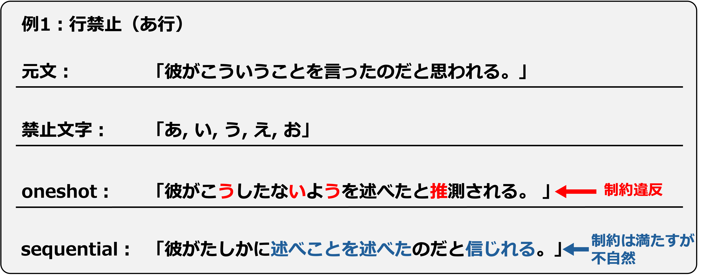
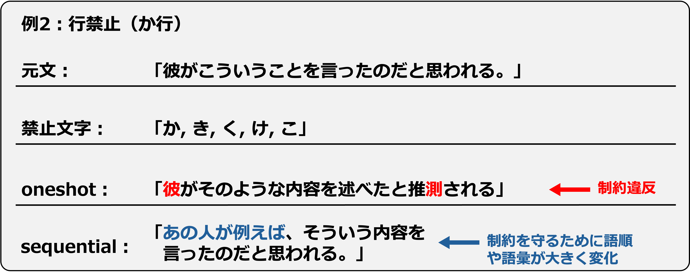

# 第7章 実験結果（Results）

本章では，第6章で定めた実験設定に基づき，oneshot と sequential の比較結果を示す。主指標である読みベース制約遵守率を中心に，補助指標（VRR/TTR，反復率，実行時間）や代表例を用いて，各方式の得意・不得意を整理する。

## 7.1 制約遵守率（主指標）
本研究の主指標は読みベース制約遵守率であり，「生成文の読み \(\mathrm{Read}(y)\) に禁止集合が一切含まれない」出力の割合として定義する。本節では，方式別（oneshot／sequential）および制約強度別（easy／medium）に成功率を示す。

まず，全465文（各方式465件）に対する成功率を表7.1に示す。成功率は，保存した実験結果ログ（CSV）の制約違反フラグに基づき集計した（再現手順は付録を参照）。

（表7.1：生成方式別の読みベース制約遵守率）

|方式|成功率|成功数/総数|
|---|---:|---:|
|oneshot|12.5%|58/465|
|sequential|91.6%|426/465|

図7.1は，表7.1と同じ集計を棒グラフとして示したものである。

（図7.1：生成方式別の読みベース制約遵守率）

次に，制約強度（easy：単音禁止，medium：行禁止）ごとの成功率を表7.2および図7.2に示す。とくに medium 条件では oneshot の成功率が大きく低下し，厳しい制約下で sequential の優位性が顕著であることが分かる。

（表7.2：制約強度×生成方式別の読みベース制約遵守率）

|制約強度|oneshot（成功率/件数）|sequential（成功率/件数）|
|---|---:|---:|
|easy|27.7%（54/195）|99.0%（193/195）|
|medium|1.5%（4/270）|86.3%（233/270）|

（図7.2：制約強度×生成方式別の読みベース制約遵守率）

次に，「同じ入力に対して両方式を試したとき，どちらが成功しやすいか」を見るために勝ち負けを集計する。本実験では，各入力（元文 \(x\) と禁止集合 \(B\) の組）に対して，oneshot と sequential をそれぞれ1回ずつ適用しているため，同じ入力に対する2つの結果を1組として比較できる。表7.3は，この1組ごとに成功フラグ（0/1）を比較し，「sequential のみ成功」「oneshot のみ成功」「同じ結果（両方成功または両方失敗）」に分類した結果である。oneshot のみが成功した例は観測されず，多くの入力で sequential が優位であることが分かる。

（表7.3：同一パターンにおける勝ち負け）

|区分|件数|割合|
|---|---:|---:|
|sequential のみ成功|368|79.1%|
|oneshot のみ成功|0|0.0%|
|同じ結果（両方成功 or 両方失敗）|97|20.9%|

成功フラグ（0/1）に対する対応のある t 検定では，方式差は統計的に極めて有意であった（\(t(464)=41.96, p\approx5.0\\times10^{-160}\)）。

## 7.2 意味保持（補助指標と代表例）
制約遵守を満たしたとしても，元文の主要な意味が損なわれていれば実用性は低い。本研究では意味保持を品質要件として位置づけるが，本論文では直接的な意味評価（意味類似度指標や人手評価）は未実施である。そこで，本章では VRR などの補助指標と代表例（7.7節）を中心に，意味保持の観点から定性的に議論し，直接的な評価指標の導入は第9章の今後課題で述べる。

## 7.3 文法性・自然性
本節では，出力が日本語としてどの程度自然に読めるか（文法性・自然性）を整理する。文法性・自然性は最終的に人手評価が必要であるが，本論文では人手評価を未実施のため，代表例（7.7節）と補助指標（7.4節の反復率など）を手がかりに，定性的に述べる。詳細な考察は第8章で行う。

## 7.4 書き換えの性質（VRR/TTR/反復）
本節では，制約遵守以外の性質として，「どれだけ大きく言い換えたか」や「語彙の多様性」を補助指標で捉える。ここでは語彙置換率（VRR）と type-token ratio（TTR）を中心に，成功ケースに限定した比較や，VRR と成功・失敗の関係を示す。

（図7.3：両方式が成功したケースにおける VRR の分布）

図7.3は，両方式がともに制約を満たした入力（58ペア）に限定し，方式ごとの VRR の分布を示す。分布の中心が oneshot の方が高く，oneshot がより大きな言い換えを行う傾向が見て取れる。

（図7.4：両方式が成功したケースにおける VRR と TTR の散布図）

図7.4は，両方式が成功したケースにおいて，VRR と TTR の関係を方式別に可視化したものである。TTR は両方式で大きく変わらない一方，VRR は oneshot 側に高い点が多く，図7.3の傾向と整合的である。

（図7.5：VRR と制約遵守成否の関係）

図7.5は，VRR と制約遵守成否（成功/失敗）の関係を示す。VRR が高い（大きく言い換える）ほど制約を満たすのが難しくなる傾向があり，成功率（7.1節）と書き換え量の間にトレードオフがあることを示唆する。

両方式が成功した 58 ペアに限定し，VRR と TTR を対応のある検定で比較すると，VRR は oneshot の方が有意に高く（より大きく言い換える傾向），TTR の差は有意とは言えない結果となった（表7.4）。

（表7.4：両方式成功ペアにおける指標差の検定）

|指標|比較対象|結果|
|---|---|---|
|VRR|sequential vs oneshot| \(t(57)=-13.74, p\approx9.8\\times10^{-20}\) |
|TTR|sequential vs oneshot| \(t(57)=-1.40, p\approx0.166\) |

補助指標のうち反復率（n-gram repetition rate）は，生成文における不自然な繰り返しの有無を確認するために用いる。本実験では，多くの出力で反復率は 0 であり，bi-gram 反復が観測された割合は sequential が 9.9%，oneshot が 5.6% であった（表7.5）。tri-gram 反復が観測された割合はいずれも 4% 未満であり，強い反復が頻出する状況ではなかった。

（表7.5：n-gram 反復率の要約）

|方式|bi-gram 反復率（平均）|bi-gram 反復ありの割合|tri-gram 反復率（平均）|tri-gram 反復ありの割合|
|---|---:|---:|---:|---:|
|oneshot|0.006|5.6%|0.003|2.4%|
|sequential|0.010|9.9%|0.004|3.7%|

## 7.5 計算コスト
本節では，方式間の計算コストを比較する。逐次生成方式は局所介入と再検査を反復するため，制約遵守率が高い一方で，実行時間が増えやすい。本論文では，1文あたりの実行時間（秒）を用いて，成功率とのトレードオフとして整理する。

表7.6に，方式ごとの1文あたり実行時間の要約（平均・中央値）を示す。逐次生成は再試行や局所介入を伴うため，成功率改善の代償として計算コストが増加する傾向がある。

（表7.6：方式別の実行時間（1文あたり））

|方式|平均（秒）|中央値（秒）|
|---|---:|---:|
|oneshot|0.696|0.615|
|sequential|7.188|2.631|

## 7.6 ベースライン・アブレーション
本研究の貢献は「枠組み」の提案にあるため，枠組み要素の寄与を切り分けて示すことは重要である。一方で，本論文では oneshot／sequential の比較を優先し，読みベース制約チェックのみ（表記ベース）や局所修正なし（全文再生成のみ）といったアブレーションは未実施である。アブレーション設計の方針は第6章で述べ，今後の課題として第9章で扱う。

## 7.7 失敗分析（定量＋定性）
本節では，失敗例を分類し，「どの条件で何がボトルネックになるか」を明らかにする。とくに，日本語では助詞や活用語尾が制約に衝突しやすいこと，行禁止のように禁止集合が大きい場合に迂回表現の探索が難しくなること，未知語・解析の揺れにより読み判定が不安定になることが，失敗要因になりうる。代表例は実験ログから抽出し，元文／禁止集合／各方式の出力を並置して示す。

（図7.6：代表例1（元文／制約／出力の比較））

図7.6は，行禁止（あ行）の例である。oneshot の出力では，「こう」「ないよう」「推測」など日常的な表現が含まれ，読みベースでは禁止集合（あ行）に該当する仮名が混入して制約違反となっている。一方，sequential は制約を満たす出力を得ているが，局所的な言い換えを積み重ねた結果として語の重複（例：「述べ…述べ…」）や不自然な言い回しが残り，制約遵守と自然さのトレードオフが表れている。

（図7.7：代表例2（元文／制約／出力の比較））

図7.7は，行禁止（か行）の例である。oneshot の出力は，「推測（すいそく）」のように読みが禁止集合（か行）に触れやすい語を含み，制約違反となっている。sequential は制約を満たすように表現を回避できているが，その過程で「彼」→「あの人」のような語彙変更や，「例えば」の挿入などが生じ，語順・語彙が大きく変化している。厳しい行禁止では，助詞や語彙の選択肢が狭まり，大きな言い換えが必要になる場合があることが分かる。
